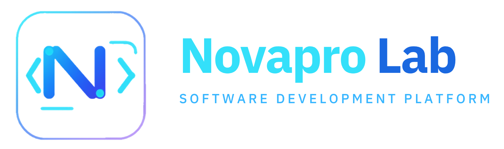

<p align="center">
  
</p>

<h1 align="center">Novapro Lab</h1>

<p align="center">
  <strong>AI software systems for business growth, automation, and operational intelligence.</strong>
</p>

<p align="center">
  
  
  
  
</p>

---

## About Novapro Lab

**Novapro Lab** is a software development and innovation studio focused on building intelligent business systems for growth, automation, and operational decision-making.

We design and develop private software platforms that help businesses simplify complex workflows, improve customer acquisition, automate repetitive operations, and transform business data into practical actions.

Our work is centered on one principle:

> Technology should reduce business complexity, not create more of it.

---

## What We Build

Novapro Lab develops software systems and digital platforms for:

- AI-assisted business operations
- customer acquisition workflows
- lead and appointment management
- operational automation
- communication workflows
- reporting and decision support
- internal business tools
- responsive dashboards
- private SaaS platforms
- API-driven systems
- business process optimization

Our platforms are designed to help companies operate with more clarity, speed, and control.

---

## Current Development Focus

Novapro Lab is actively developing private AI-powered business systems focused on:

- growth operations
- customer communication
- business workflow automation
- operational intelligence
- document and communication workflows
- responsive management dashboards
- AI-assisted recommendations
- secure multi-user business platforms

Some projects are public for presentation, documentation, or SDK distribution purposes.  
Core platform implementation, internal architecture, credentials, and proprietary logic remain private.

---

## Development Philosophy

### AI-first systems

We build software where AI is part of the operating layer, not just an add-on feature.

### Business-centered design

Our interfaces are designed around business language: customers, leads, bookings, appointments, actions, alerts, opportunities, and decisions.

### Secure by design

Sensitive logic, credentials, private workflows, customer data, infrastructure details, and internal automation rules are not exposed publicly.

### Responsive from the beginning

Our systems are designed for real operational use across desktop, laptop, tablet, and mobile environments.

### Practical automation

Automation should support human decision-making, reduce manual work, and improve operational consistency.

---

## Public Repository Policy

Public repositories under this organization may include selected materials such as:

- public-safe documentation
- open presentation assets
- SDK packages intended for public distribution
- non-sensitive examples
- product overview materials
- controlled technical references

Public repositories should not include:

```txt
.env files
API keys
OAuth secrets
database credentials
private certificates
customer data
internal access tokens
production credentials
private endpoints
infrastructure secrets
proprietary business logic
internal automation rules
commercial strategy documents
tenant-specific information
security-sensitive implementation details
```

---

## Security & Confidentiality

Novapro Lab maintains a strict separation between public presentation materials and private implementation systems.

The following remain private unless explicitly approved for release:

- backend architecture
- AI orchestration logic
- provider integrations
- internal workflows
- customer data models
- infrastructure configuration
- operational rules
- business strategy
- proprietary source code
- private documentation
- production environment details

If sensitive information is accidentally published, the affected credential or resource should be revoked, rotated, and reviewed immediately.

---

## Repository Visibility

Not every Novapro Lab project is intended to be public.

Some repositories are private because they contain proprietary systems, internal platforms, protected workflows, or active product development. Public visibility is used only when it supports documentation, package distribution, organizational presence, or approved technical presentation.

---

## Technologies & Areas of Work

Novapro Lab works across areas such as:

- web application development
- API design
- WordPress plugin development
- JavaScript frontend systems
- PHP backend systems
- Python tooling
- AI-assisted workflows
- automation pipelines
- communication systems
- document generation
- dashboard development
- business process software

Technology choices depend on the needs, security requirements, and operational context of each project.

---

## Legal Notice

Unless explicitly stated otherwise, all source code, documentation, workflows, designs, product concepts, architecture decisions, assets, and related materials in private Novapro Lab repositories are proprietary and confidential.

Unauthorized use, reproduction, redistribution, reverse engineering, commercialization, or derivative implementation is prohibited.

---

## Ownership

© 2026 Novapro Lab, a DBA of Novapro Multi-Services LLC.  
All rights reserved.

---

<p align="center">
  <strong>Novapro Lab</strong><br>
  AI systems for business growth, automation, and operational intelligence.
</p>

Carpeta comprimida con la ruta corr
