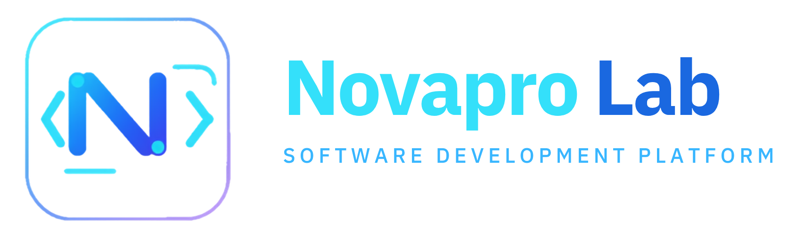

<p align="center">
  
</p>

<h1 align="center">Novapro Lab™</h1>

<p align="center">
  <strong>AI commercial systems for customer acquisition, automation, and operational intelligence.</strong>
</p>

<p align="center">
  
  
  
  
</p>

---

## About Novapro Lab™

**Novapro Lab™** is a software development and innovation studio focused on building private AI-powered business systems for customer acquisition, commercial operations, workflow automation, and operational decision-making.

We design and develop software platforms that help organizations simplify complex workflows, attract customers, manage leads, create appointments, improve follow-up, support sales operations, and transform business information into practical actions.

Our work is centered on one principle:

> Technology should reduce business complexity, not create more of it.

Novapro Lab™ builds systems for real business execution, not software that creates more dashboards, reports, or manual operational burden.

---

## What We Build

Novapro Lab™ develops private software systems and digital platforms for:

- AI-assisted business operations
- customer acquisition workflows
- lead capture and qualification
- appointment and booking workflows
- sales support and follow-up operations
- customer communication workflows
- operational automation
- internal business tools
- decision support systems
- responsive management interfaces
- private SaaS platforms
- API-driven systems
- business process optimization

Our platforms are designed to help companies operate with more clarity, speed, control, and commercial focus.

---

## Current Development Focus

Novapro Lab™ is actively developing private AI-powered systems focused on:

- customer acquisition
- lead generation and qualification
- appointment creation and management
- sales workflow support
- business communication
- operational automation
- commercial intelligence
- secure multi-user business platforms
- workflow visibility and control
- AI-assisted recommendations and actions

Our systems are designed to support business outcomes such as more customers, qualified leads, booked appointments, stronger follow-up, improved sales opportunities, and better operational decisions.

Some repositories may be public for presentation, documentation, SDK distribution, or organization-profile purposes. Core platform implementation, internal architecture, proprietary logic, private workflows, credentials, customer data, and strategic operating details remain private.

---

## Development Philosophy

### AI as an operating layer

We build systems where AI is part of the operating layer of the business, not just an add-on feature or a chat interface.

### Business-centered design

Our interfaces are designed around practical business language: customers, leads, appointments, bookings, follow-ups, opportunities, actions, alerts, approvals, and decisions.

### Execution with control

Automation should help businesses move faster while preserving visibility, control, responsibility, and operational discipline.

### Secure by design

Sensitive logic, credentials, customer data, private workflows, infrastructure details, commercial strategy, and internal automation rules are not exposed publicly.

### Responsive from the beginning

Our systems are designed for real operational use across desktop, laptop, tablet, and mobile environments.

### Practical automation

Automation should reduce manual work, improve consistency, support human decision-making, and help teams act on opportunities faster.

---

## Public Repository Policy

Public repositories under this organization may include selected materials such as:

- public-safe documentation
- open presentation assets
- SDK packages intended for public distribution
- non-sensitive examples
- product overview materials
- controlled technical references
- organization-profile materials

Public repositories should not include:

```txt
.env files
API keys
OAuth secrets
database credentials
private certificates
customer data
internal access tokens
production credentials
private endpoints
infrastructure secrets
proprietary business logic
internal automation rules
commercial strategy documents
tenant-specific information
security-sensitive implementation details
private AI orchestration logic
private learning logic
private scoring models
private prompts or agent instructions
provider credentials
secret manager references
```

---

## Security & Confidentiality

Novapro Lab maintains a strict separation between public presentation materials and private implementation systems.

The following remain private unless explicitly approved for release:

- backend architecture
- AI orchestration logic
- proprietary learning systems
- provider integrations
- internal workflows
- customer data models
- infrastructure configuration
- operational rules
- commercial strategy
- proprietary source code
- private documentation
- production environment details
- security-sensitive implementation details
- tenant-specific information
- internal prompts, policies, and automation instructions

If sensitive information is accidentally published, the affected credential, token, access grant, or resource should be revoked, rotated, reviewed, and remediated immediately.

---

## Repository Visibility

Not every Novapro Lab™ project is intended to be public.

Some repositories are private because they contain proprietary systems, internal platforms, protected workflows, product development, operational logic, customer data structures, or security-sensitive implementation details.

Public visibility is used only when it supports documentation, package distribution, organizational presence, open presentation assets, or approved technical presentation.

---

## Technologies & Areas of Work

Novapro Lab™ works across areas such as:

- web application development
- API design
- WordPress plugin development
- JavaScript frontend systems
- PHP backend systems
- Python tooling
- AI-assisted workflows
- automation pipelines
- communication systems
- document generation
- dashboard and interface development
- commercial workflow systems
- business process software
- private SaaS platforms

Technology choices depend on the needs, security requirements, operating context, and long-term maintainability of each project.

---

## Legal Notice

Unless explicitly stated otherwise, all source code, documentation, workflows, designs, product concepts, architecture decisions, assets, and related materials in private Novapro Lab repositories are proprietary and confidential.

Unauthorized use, reproduction, redistribution, reverse engineering, commercialization, or derivative implementation is prohibited.

---

## Ownership

© 2026 Novapro LLC.  
Novapro Lab LLC.  
All rights reserved.

---

<p align="center">
  <strong>Novapro Lab™</strong><br>
  AI commercial systems for customer acquisition, automation, and operational intelligence.
</p>

